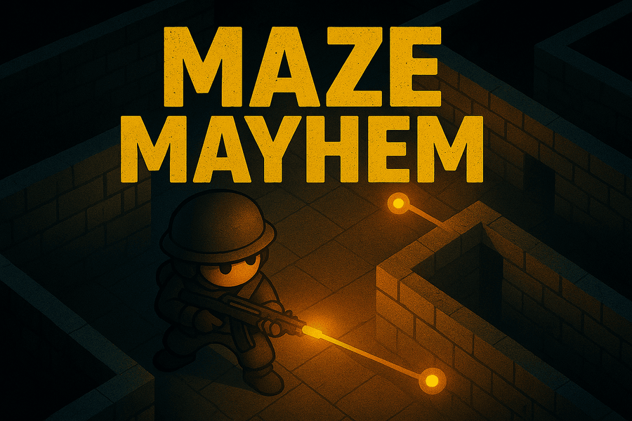

# Maze Mayhem

<p align="center">
  
</p>

[](https://www.youtube.com/watch?v=rXbsMpnOnzw)


Maze Mayhem is a 2D top-down multiplayer shooter set in a maze. Up to five players connect over a local network and fight in short, high-pressure rounds with bouncing projectiles, one-shot kills and limited vision.

The game is written in **C** using **SDL2** and a custom TCP networking layer, and was developed as a university project to practise game programming, networking and systems-level C.

---

## Key Features

- **LAN multiplayer:** Host or join matches with multiple players over TCP using SDL_net.
- **Maze-based arenas:** Tile-based maze layout with walls that create choke points and angles.
- **Bouncing projectiles:** Shots can ricochet off walls and, after a distance, even kill the shooter.
- **Fog-of-war:** Players only see nearby parts of the maze; distant tiles are darkened.
- **Spectator mode:** After death, players can switch to a full-map spectator view.
- **Audio system:** Background music and sound effects with in-game volume controls.
- **Cross-platform C code:** Builds on Windows, macOS and Linux with SDL2 and a simple Makefile.

---

## Tech Stack

- **Language:** C
- **Core library:** SDL2
- **SDL2 extensions:**
  - SDL2_image – textures and sprites
  - SDL2_net – TCP networking
  - SDL2_mixer – audio playback
  - SDL2_ttf – font rendering
- **Build system:** Makefile
- **Networking:** TCP sockets via SDL2_net with a custom message protocol

---

## Getting Started

### Prerequisites

You need SDL2 and the required extensions installed.

#### macOS (Homebrew)

```bash
brew install sdl2 sdl2_image sdl2_net sdl2_mixer sdl2_ttf
```

#### Linux (Debian/Ubuntu)

```bash
sudo apt-get install \
  libsdl2-dev libsdl2-image-dev libsdl2-net-dev \
  libsdl2-mixer-dev libsdl2-ttf-dev
```

#### Windows

Use **MSYS2** or **vcpkg** to install SDL2 and the extensions, then make sure `gcc` and `make` are available in your shell.  
Adjust the SDL include/lib paths in the `Makefile` if needed.

---

### Building

Clone the repository and build with `make`:

```bash
git clone https://github.com/your-username/maze-mayhem.git
cd maze-mayhem
make
```

This produces a `game` (macOS/Linux) or `game.exe` (Windows) binary in the project root.

---

### Running

```bash
# macOS / Linux
./game

# Windows
./game.exe
```

---

## How to Play

1. **Main menu**
   - **Host Game** – start a new lobby as the host.
   - **Join Game** – connect to a host by entering their IP address.
   - **Settings** – adjust music and sound effects volume.

2. **Lobby**
   - Other players connect to the host's IP.
   - When everyone is ready, the host starts the match.

3. **Controls**
   - **Move:** WASD or Arrow keys
   - **Aim:** Mouse cursor
   - **Shoot:** Spacebar
   - **Quit:** Esc
   - **Spectate (on death):** Click the **SPECTATE** button on the death screen.

4. **Objective**
   - Survive and be the last player alive.
   - Use walls to create angles; remember that projectiles bounce and can come back at you.

---

## Project Structure

```text
.
├── include/              # Header files for all subsystems
│   ├── audio_manager.h   # Music and sound effect handling
│   ├── camera.h          # Camera and world-to-screen logic
│   ├── constants.h       # Global constants and config values
│   ├── game_core.h       # Game loop and state definitions
│   ├── lobby.h           # Lobby UI and logic
│   ├── maze.h            # Maze layout and rendering
│   ├── menu.h            # Main menu and settings
│   ├── network.h         # Networking interface
│   ├── player.h          # Player state and behaviour
│   └── projectile.h      # Projectile behaviour and collisions
├── source/               # C source files
│   ├── audio_manager.c
│   ├── camera.c
│   ├── client.c          # Entry point, SDL/SDL_net init and main loop bootstrap
│   ├── game_core.c
│   ├── lobby.c
│   ├── maze.c
│   ├── menu.c
│   ├── network.c
│   ├── player.c
│   └── projectile.c
├── resources/            # Art, fonts and audio
│   ├── coverart.png      # Cover art used in README and menus
│   ├── Tiles.bmp         # Maze tileset
│   ├── wallTexture.webp  # Wall textures
│   ├── player_*.png      # Player sprites
│   ├── projectile*.png   # Projectile sprites
│   ├── font.ttf          # Game font
│   ├── backgroundMusic/  # Music tracks
│   └── sfx/              # Sound effects
├── Makefile              # Build configuration
└── .vscode/              # Optional editor configuration
```

---

## Possible Extensions

The codebase is structured so it can be extended with features such as:

- Additional weapons or projectile types
- Power-ups (shield, speed boost, rapid fire)
- Multiple map layouts or procedural maze generation
- In-game scoreboard and post-round statistics
- Improved UI animations and visual polish

---

## Credits

Maze Mayhem was developed as a group project using C and SDL2 as part of a university course in application development.
